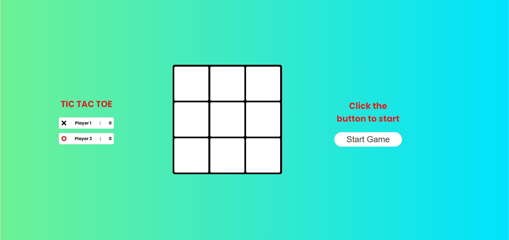
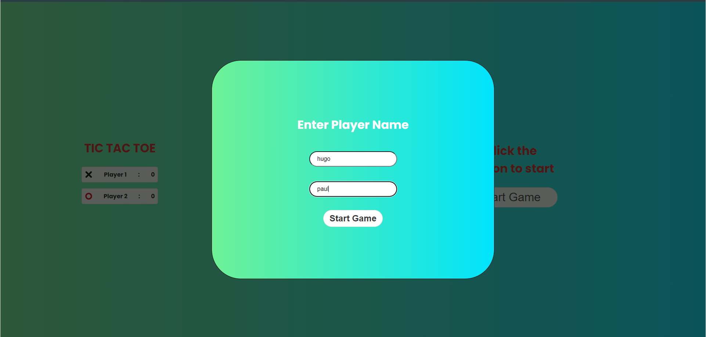
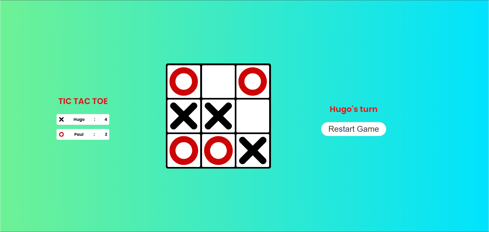

# Tic-Tac-Toe

### :clipboard: GAME DESCRIPTION :
Tic Tac Toe is a two-player game (one of them being played by computer or human). In this game, there is a board with 3 x 3 squares.

The two players take turns putting marks on a 3x3 board. The goal of Tic Tac Toe game is to be one of the players to get three same symbols in a row - horizontally, vertically or diagonally on a 3 x 3 grid. The player who first gets 3 of his/her symbols in a row - vertically, horizontally, or diagonally wins the game, and the other loses the game.

### :scroll: GAME RULES :
1. The game is played on a grid that's 3 squares by 3 squares.
2. You are X, your friend (or the computer in this case) is O. Players take turns putting their marks in empty squares.
3. The first player to get 3 of her marks in a row (up, down, across, or diagonally) is the winner.
4. When all 9 squares are full, the game is over. If no player has 3 marks in a row, the game ends in a tie.

### :video_game: HOW TO PLAY :
1. The game starts with an empty 3x3 grid.
2. The player who is playing 'X' always goes first.
3. Players alternate placing Xs and Os on the board until either player has three in a row, horizontally, vertically, or diagonally or until all squares on the grid are filled.
4. If a player is able to draw three Xs or three Os in a row, then that player wins.
5. If all squares are filled and no player has won, then the game is a draw.

### :gear: HOW TO RUN :
1. Clone the repository.
2. Open the terminal and navigate to the directory where the repository is cloned.
3. install the extension 'Live Server' in Visual Studio Code.
4. Right-click on the 'index.html' file and select 'Open with Live Server'.
5. The game will open in your default browser.

### :camera_flash: SCREENSHOTS :
1. Initial Screen :

2. Entrering Player Names :

3. Game Screen :

